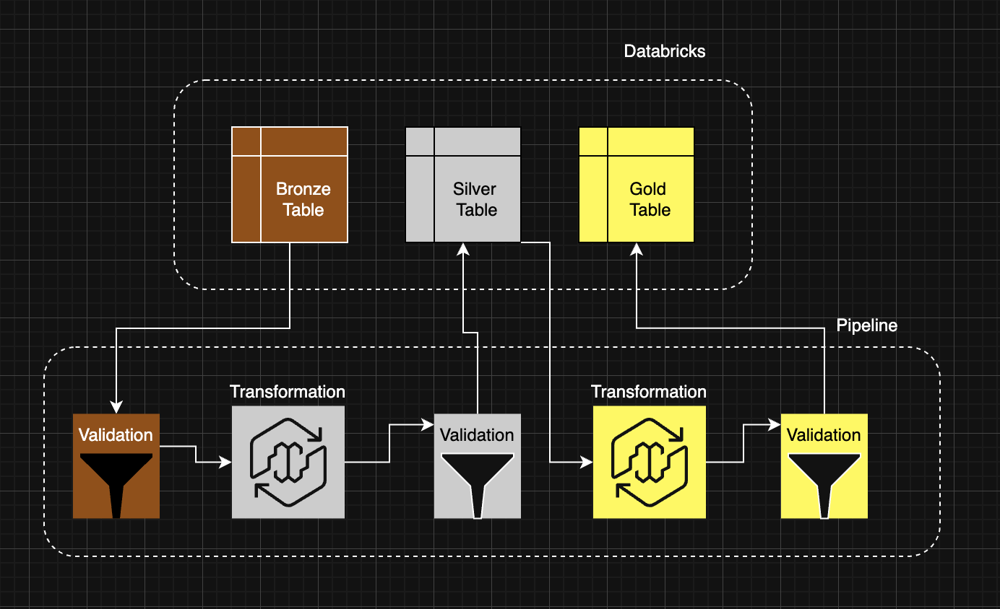

# PipelineBuilder Framework - Leadership Overview

## Overview

The PipelineBuilder Framework is an enterprise-grade data engineering solution that simplifies the creation and execution of data pipelines following the Medallion Architecture pattern. It provides a robust, scalable, and maintainable approach to transforming raw data into analytics-ready insights.

**Last Updated:** October 2024  
**Version:** 1.3.3

## What Problem Does This Solve?

### Current State Challenges

- **Complex Pipeline Development**: Building data pipelines requires extensive custom code, deep technical expertise, and significant time investment
- **Operational Overhead**: Managing pipeline dependencies, error handling, monitoring, and recovery is time-consuming and error-prone
- **Quality Concerns**: Ensuring data quality and validation at each stage requires manual implementation and constant vigilance
- **Maintenance Burden**: Making changes to existing pipelines often requires understanding complex legacy code and risking unintended side effects

### PipelineBuilder Solution

- **Simple Configuration**: Define your data transformations using straightforward configuration instead of complex code
- **Automated Orchestration**: The framework handles execution order, dependency management, and error recovery automatically
- **Built-in Quality Gates**: Data validation and quality checks are built into every stage of the pipeline
- **Enterprise-Ready**: Designed for production use with monitoring, logging, and scalability built-in

## How It Works

### The Medallion Architecture

The framework implements the proven Medallion Architecture pattern, organizing data into three layers:

**Bronze Layer - Raw Data**
- Ingest raw data from source systems
- Validate data quality against defined rules
- Store validated raw data in memory for processing
- Track data lineage and quality metrics

**Silver Layer - Cleaned Data**
- Transform and enrich raw data
- Apply business logic and data cleaning rules
- Persist cleaned data to Delta Lake storage
- Enable downstream consumers to access reliable data

**Gold Layer - Analytics Data**
- Aggregate data for business intelligence and reporting
- Create analytical models and metrics
- Power dashboards and decision-making tools
- Serve as the single source of truth for analytics

### Key Capabilities

**1. Automatic Dependency Management**
- The framework analyzes all data transformations and determines the optimal execution order
- Parallel processing is automatically applied where safe
- No manual orchestration required - the system handles it all

**2. Built-in Data Validation**
- Quality gates at every stage ensure only valid data progresses
- Configurable validation rules match your business requirements
- Automatic rejection of data that fails quality checks
- Detailed reporting on data quality metrics

**3. Flexible Execution Modes**
- **Initial Load**: One-time setup for new datasets
- **Incremental**: Daily/hourly updates processing only new data
- **Full Refresh**: Complete reprocessing when needed
- **Validation Only**: Quality checks without writing data

**4. Comprehensive Monitoring**
- Real-time execution tracking
- Performance metrics and trend analysis
- Automatic anomaly detection
- Historical audit trail of all pipeline runs

## Business Benefits

### Speed to Value

**Before**: Weeks to months to build a production-ready data pipeline  
**With PipelineBuilder**: Hours to days to configure and deploy

### Reduced Operational Costs

- **Less Custom Code**: Up to 70% reduction in code needed for pipeline development
- **Fewer Errors**: Built-in validation and error handling prevent costly data quality issues
- **Lower Maintenance**: Standardized approach reduces ongoing support burden

### Improved Data Quality

- **Consistent Validation**: All pipelines use the same quality framework
- **Early Detection**: Catch data quality issues before they impact downstream systems
- **Audit Trail**: Complete history of data transformations and quality metrics

### Scalability

- **Parallel Processing**: Automatically leverages available compute resources
- **Incremental Updates**: Process only changed data, reducing compute costs
- **Cloud-Native**: Designed to scale with your data volume growth

## Key Features

### For Data Engineers

- **Configuration Over Code**: Define pipelines declaratively rather than writing custom code
- **Type Safety**: Framework ensures correct data types and schemas throughout
- **Debugging Tools**: Built-in tools for troubleshooting and optimization
- **Standard Patterns**: Best practices built into the framework

### For Data Quality Teams

- **Validation Framework**: Robust rule-based validation at every stage
- **Quality Metrics**: Comprehensive reporting on data quality trends
- **Anomaly Detection**: Automatic identification of unusual patterns
- **Compliance Support**: Audit trails and lineage tracking

### For Leadership

- **Transparency**: Clear visibility into pipeline health and performance
- **Governance**: Standardized approach across all data pipelines
- **Risk Mitigation**: Built-in safeguards prevent costly data errors
- **ROI Tracking**: Metrics to measure platform value and impact

## Use Cases

### Customer Analytics

Transform raw transaction data into customer behavior insights, enabling targeted marketing campaigns and personalized experiences.

### Financial Reporting

Aggregate financial data across multiple sources to produce timely, accurate reports for stakeholders and regulators.

### Supply Chain Optimization

Process logistics and inventory data to identify bottlenecks, optimize routes, and reduce operational costs.

### Real-Time Decision Making

Stream data through the Medallion layers to power real-time dashboards and automated decision systems.

## Architecture Benefits

### Reliability

- **ACID Transactions**: Data integrity guaranteed through Delta Lake technology
- **Time Travel**: Ability to query historical versions of data for auditing and recovery
- **Schema Evolution**: Graceful handling of changing data structures
- **Error Recovery**: Automatic retry and failure handling

### Performance

- **Parallel Execution**: Process multiple transformations simultaneously
- **Optimized Storage**: Delta Lake provides efficient data layout and indexing
- **Incremental Processing**: Only process new or changed data
- **Resource Management**: Intelligent allocation of compute resources

### Observability

- **Execution Logs**: Detailed logs of every pipeline run
- **Performance Metrics**: Track execution times and resource usage
- **Data Quality Scores**: Monitor quality trends over time
- **Alerting**: Automated notifications for failures or anomalies

## Technology Stack

**Built On Industry Standards**

- **Delta Lake**: Open-source storage layer providing reliability and performance
- **Apache Spark**: Distributed computing engine for scale
- **Python**: Widely-used programming language for data engineering
- **Databricks**: Cloud-native platform for big data processing

**Enterprise Ready**

- Designed for production deployments
- Supports multi-cloud environments
- Integrates with existing data infrastructure
- Compatible with modern BI and analytics tools

## Implementation Approach

### Phase 1: Pilot (Weeks 1-2)
- Deploy framework in test environment
- Configure 1-2 representative pipelines
- Validate approach and gather feedback

### Phase 2: Production Deployment (Weeks 3-4)
- Deploy to production environment
- Migrate existing critical pipelines
- Train data engineering team

### Phase 3: Scale (Ongoing)
- Expand to additional use cases
- Build organizational expertise
- Continuously optimize based on learnings

### Success Factors

**Organizational Adoption**
- Clear training materials and documentation
- Hands-on workshops for data engineers
- Regular feedback loops and continuous improvement

**Governance**
- Standardized validation rules and quality thresholds
- Code review processes for pipeline configurations
- Regular audits of data quality and pipeline health

**Support**
- Dedicated team for framework maintenance
- Active community and knowledge sharing
- Regular updates and feature enhancements

## Risk Mitigation

### Data Quality Risks

**Challenge**: Incorrect or incomplete data reaching analytics  
**Solution**: Multi-layer validation at Bronze, Silver, and Gold stages with configurable quality thresholds

**Challenge**: Schema changes breaking downstream systems  
**Solution**: Automatic schema evolution and compatibility checking

### Operational Risks

**Challenge**: Pipeline failures causing data gaps  
**Solution**: Built-in error handling, retry logic, and detailed failure reporting

**Challenge**: Performance degradation as data volume grows  
**Solution**: Incremental processing, parallel execution, and optimization tools

### Business Risks

**Challenge**: Unclear data lineage making audits difficult  
**Solution**: Automatic tracking of data transformations and quality metrics

**Challenge**: Changes to pipelines causing unexpected results  
**Solution**: Validation-only mode for testing and comprehensive change impact analysis

## Success Metrics

### Technical Metrics

- **Pipeline Reliability**: Target 99.5%+ successful execution rate
- **Data Quality**: Monitor validation pass rates and trend analysis
- **Performance**: Track execution times and optimize for efficiency
- **Automation**: Measure reduction in manual intervention

### Business Metrics

- **Time to Production**: Reduction in time from idea to deployed pipeline
- **Cost per Pipeline**: Tracking operational costs and compute usage
- **Developer Productivity**: Measuring code reduction and speed of development
- **Business Impact**: Improved decision-making quality and speed

## Investment and ROI

### Development Cost Savings

**Traditional Approach**: 20-40 hours per pipeline + ongoing maintenance  
**PipelineBuilder**: 2-4 hours per pipeline + minimal maintenance

**Estimated Savings**: 70-80% reduction in development time

### Operational Cost Reductions

- Reduced compute costs through incremental processing
- Fewer support tickets and production issues
- Lower training requirements due to standardization
- Less time spent on debugging and troubleshooting

### Business Value

- Faster time to insights enabling quicker decision-making
- Improved data quality leading to better business outcomes
- Enhanced agility to respond to changing business needs
- Standardized approach improving organizational maturity

## Next Steps

### For Technical Teams

1. Review framework documentation and examples
2. Identify pilot use cases
3. Schedule hands-on training sessions
4. Plan migration strategy for existing pipelines

### For Leadership

1. Understand business benefits and ROI
2. Approve pilot project and budget
3. Establish success criteria and metrics
4. Plan organizational rollout strategy

### For Governance Teams

1. Review data quality and validation standards
2. Establish pipeline configuration guidelines
3. Define monitoring and alerting requirements
4. Create change management process

## Conclusion

The PipelineBuilder Framework represents a paradigm shift in how organizations build and operate data pipelines. By standardizing patterns, automating orchestration, and embedding quality controls, it enables data teams to deliver value faster while reducing operational risk and costs.

The framework is not just a technical tool—it's an investment in organizational capability that pays dividends through improved agility, reliability, and data quality across all analytics initiatives.

---

**Questions or Need More Information?**

- Technical Documentation: See `COMPREHENSIVE_USER_GUIDE.md`
- API Reference: See `docs/ENHANCED_API_REFERENCE.md`
- Security Guide: See `docs/SECURITY_GUIDE.md`
- Deployment Guide: See `docs/DEPLOYMENT_GUIDE.md`

